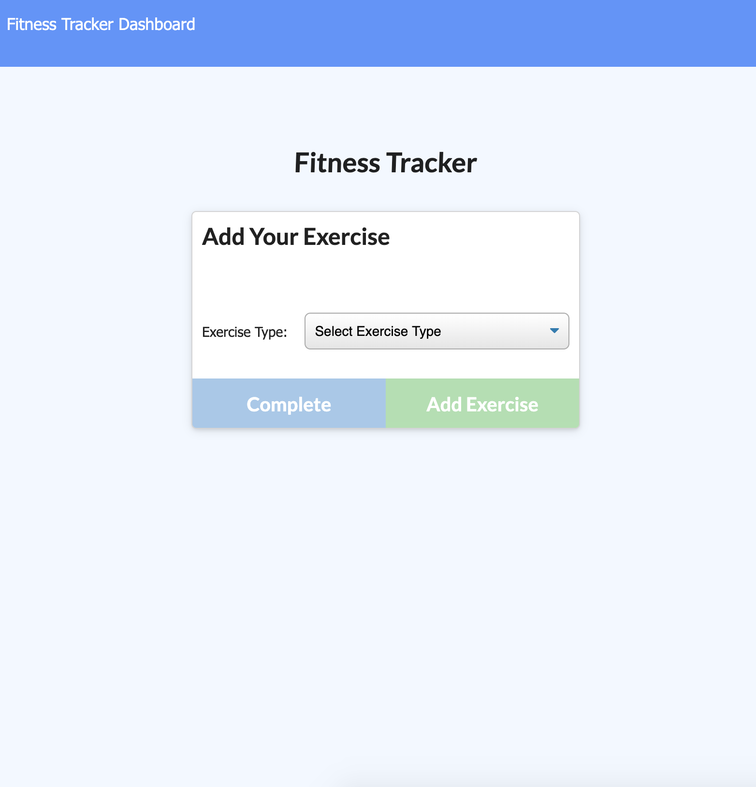
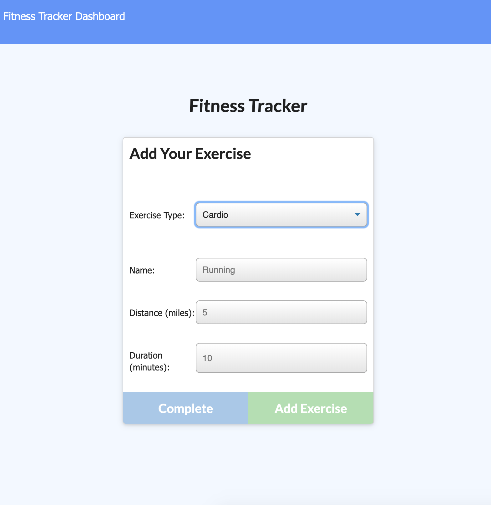
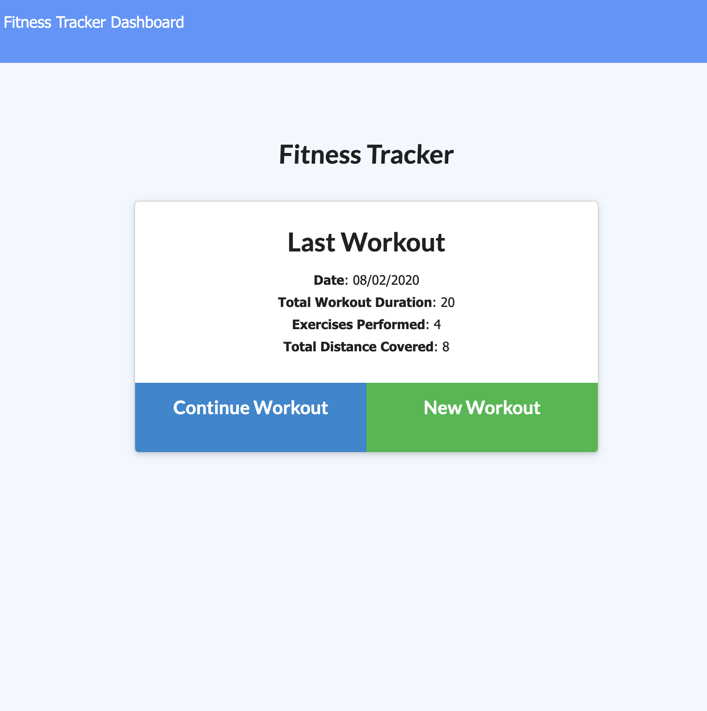
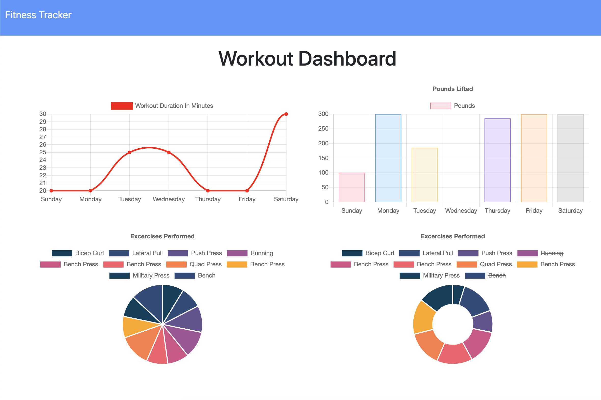

# Workout Tracker

A NoSQL Workout Tracker application in node.js that helps a user reach their fitness goals quicker when they track their workout progress. The deployed app can be viewed on https://fitness-stats-tracker.herokuapp.com/?id=5e459dd65a14cf0017255edc.

## Software used

Node.js, mongoose, node-express and morgan. And sweat and tears :P

## Installation guide

- Clone the repository from Github
- Run the `npm i` command to install dependencies
- Run the seed file with the `node seeders/seed.js` command
- And finally, start the server with `node server.js`
- Go to your local host and enjoy

## How it works

- Choose either cardio or resistance from the dropdown list
  

- Add details of your workout
  

- Add exercise or complete your workout. Once you complete, a summary appears:
  

- You can also look at the stats to see progress over time:
  
